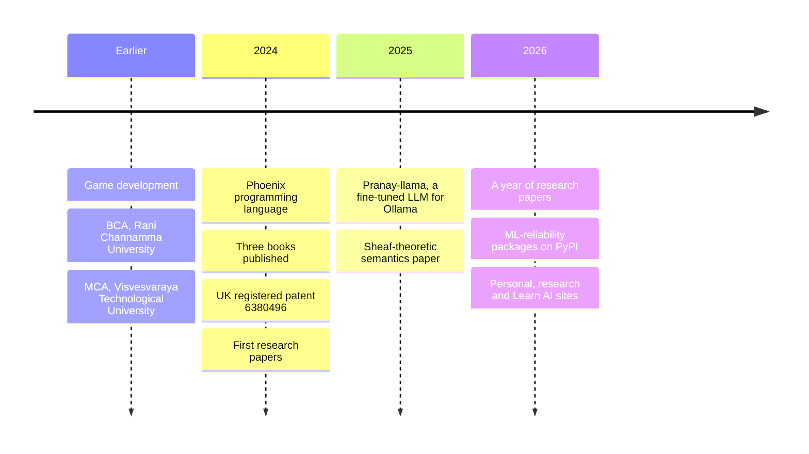

<div align="center">

<picture>
  <source media="(prefers-color-scheme: dark)" srcset="https://raw.githubusercontent.com/PranayMahendrakar/PranayMahendrakar/main/assets/banner-dark.svg">
  <source media="(prefers-color-scheme: light)" srcset="https://raw.githubusercontent.com/PranayMahendrakar/PranayMahendrakar/main/assets/banner-light.svg">
  
</picture>

**AI Specialist and LLM Engineer &nbsp;|&nbsp; Managing Director, SonyTech &nbsp;|&nbsp; Author**

**[pranaymahendrakar.com](https://pranaymahendrakar.com/)** &nbsp;·&nbsp; [Research papers](https://research.pranaymahendrakar.com/) &nbsp;·&nbsp; [Learn AI](https://learn.pranaymahendrakar.com/) &nbsp;·&nbsp; [Google Scholar](https://scholar.google.com/citations?user=7EecYNMAAAAJ) &nbsp;·&nbsp; [ORCID](https://orcid.org/0009-0003-7224-029X) &nbsp;·&nbsp; [LinkedIn](https://www.linkedin.com/in/pranay-mahendrakar-84bb3b197/) &nbsp;·&nbsp; [YouTube](https://www.youtube.com/@Pranay_Mahendrakar)

</div>

## About

Pranay Mahendrakar is an Indian AI specialist and LLM engineer based in Bengaluru, India. He is the Managing Director of SonyTech, Nodal Coordinator at IIRS-ISRO, and an instructor at Tutorials Point. His work covers large language models, natural language processing, computer vision and retrieval-augmented generation. He publishes open-access research papers and is the author of three books: Just AI With Pranay, Multiverse of AI and It's Me LLM.

- 🏆 Holder of **UK registered patent #6380496** in blockchain-enabled decentralised cloud computing
- 💻 Creator of the **Phoenix programming language**
- ⚙️ **250+ AI systems** delivered across the automotive, defence and education sectors

## At a glance

<!-- TILES:START -->
<p align="center">
  <a href="https://research.pranaymahendrakar.com/"><picture><source media="(prefers-color-scheme: dark)" srcset="https://raw.githubusercontent.com/PranayMahendrakar/PranayMahendrakar/main/assets/tile-papers-dark.svg"><source media="(prefers-color-scheme: light)" srcset="https://raw.githubusercontent.com/PranayMahendrakar/PranayMahendrakar/main/assets/tile-papers-light.svg"></picture></a>
  <a href="https://github.com/PranayMahendrakar?tab=repositories"><picture><source media="(prefers-color-scheme: dark)" srcset="https://raw.githubusercontent.com/PranayMahendrakar/PranayMahendrakar/main/assets/tile-repos-dark.svg"><source media="(prefers-color-scheme: light)" srcset="https://raw.githubusercontent.com/PranayMahendrakar/PranayMahendrakar/main/assets/tile-repos-light.svg"></picture></a>
  <a href="https://leetcode.com/u/PranayMahendrakar/"><picture><source media="(prefers-color-scheme: dark)" srcset="https://raw.githubusercontent.com/PranayMahendrakar/PranayMahendrakar/main/assets/tile-leetcode-dark.svg"><source media="(prefers-color-scheme: light)" srcset="https://raw.githubusercontent.com/PranayMahendrakar/PranayMahendrakar/main/assets/tile-leetcode-light.svg"></picture></a>
  <a href="https://github.com/PranayMahendrakar"><picture><source media="(prefers-color-scheme: dark)" srcset="https://raw.githubusercontent.com/PranayMahendrakar/PranayMahendrakar/main/assets/tile-contributions-dark.svg"><source media="(prefers-color-scheme: light)" srcset="https://raw.githubusercontent.com/PranayMahendrakar/PranayMahendrakar/main/assets/tile-contributions-light.svg"></picture></a>
  <a href="https://pypi.org/user/pranaymahendrakar/"><picture><source media="(prefers-color-scheme: dark)" srcset="https://raw.githubusercontent.com/PranayMahendrakar/PranayMahendrakar/main/assets/tile-packages-dark.svg"><source media="(prefers-color-scheme: light)" srcset="https://raw.githubusercontent.com/PranayMahendrakar/PranayMahendrakar/main/assets/tile-packages-light.svg"></picture></a>
  <a href="https://pranaymahendrakar.com/about"><picture><source media="(prefers-color-scheme: dark)" srcset="https://raw.githubusercontent.com/PranayMahendrakar/PranayMahendrakar/main/assets/tile-books-dark.svg"><source media="(prefers-color-scheme: light)" srcset="https://raw.githubusercontent.com/PranayMahendrakar/PranayMahendrakar/main/assets/tile-books-light.svg"></picture></a>
</p>
<!-- TILES:END -->

> [!NOTE]
> The six tiles, the two charts below and the three "latest" lists are redrawn once a day by a [script in this repository](scripts/build_profile.py) from GitHub, LeetCode, the blog and podcast feeds, [research.pranaymahendrakar.com](https://research.pranaymahendrakar.com/) and the package list on pranaymahendrakar.com. The rest of the page is written by hand.

## Latest research

Open access, each with a permanent DOI. All <!-- PAPER-COUNT:START -->72<!-- PAPER-COUNT:END --> papers are at [research.pranaymahendrakar.com](https://research.pranaymahendrakar.com/).

<!-- PAPERS:START -->
- [Detectors Say 'Different', Not 'What'](https://research.pranaymahendrakar.com/p/detectors-say-different-not-what) &mdash; [DOI](https://doi.org/10.5281/zenodo.23147856) <sub>2026-10-05</sub>
- [The Precursor Assumption](https://research.pranaymahendrakar.com/p/the-precursor-assumption-what-an-early-warning-threshold) &mdash; [DOI](https://doi.org/10.5281/zenodo.23138107) <sub>2026-10-04</sub>
- [Spend the Budget on the Known or the Unknown?](https://research.pranaymahendrakar.com/p/spend-the-budget-on-the-known-or-the-unknown-open-set) &mdash; [DOI](https://doi.org/10.5281/zenodo.23130464) <sub>2026-10-04</sub>
- [The Evaluator Is the Bottleneck](https://research.pranaymahendrakar.com/p/the-evaluator-is-the-bottleneck) &mdash; [DOI](https://doi.org/10.5281/zenodo.23130396) <sub>2026-10-04</sub>
- [Whose Goals? Autotelic Agents Generate Goals Within Spaces They Are Given: The Goal Space and the Referee…](https://research.pranaymahendrakar.com/p/whose-goals-autotelic-agents-generate-goals-within-spaces) &mdash; [DOI](https://doi.org/10.5281/zenodo.23112895) <sub>2026-10-03</sub>
<!-- PAPERS:END -->

## Latest writing

<!-- POSTS:START -->
- [A 125B model now runs on a gaming GPU. Whether it's good enough is the real question.](https://pranaymahendrakar.com/blog/a-125b-model-now-runs-on-a-gaming-gpu-whether-its-good-enough-is-the-r) <sub>2026-10-05</sub>
- [A deepfake detector that runs on light is a hardware story, not a model story.](https://pranaymahendrakar.com/blog/a-deepfake-detector-that-runs-on-light-is-a-hardware-story-not-a-model) <sub>2026-10-04</sub>
- [Exploits now arrive in under a day. Your patch cycle still runs on weeks.](https://pranaymahendrakar.com/blog/exploits-now-arrive-in-under-a-day-your-patch-cycle-still-runs-on-week) <sub>2026-10-03</sub>
- [Robots now think with a cloud model. Most factory floors can't depend on that.](https://pranaymahendrakar.com/blog/robots-now-think-with-a-cloud-model-most-factory-floors-cant-depend-on) <sub>2026-10-02</sub>
- [OpenAI just cut frontier pricing to a fifth. Your model bill was never the real problem.](https://pranaymahendrakar.com/blog/openai-just-cut-frontier-pricing-to-a-fifth-your-model-bill-was-never-) <sub>2026-10-01</sub>
<!-- POSTS:END -->

More at [pranaymahendrakar.com/blog](https://pranaymahendrakar.com/blog).

## Podcast: The Founder Mindset Operating System

<!-- VIDEOS:START -->
- [Building Your Life's Mission \| The Founder Mindset Podcast EP012](https://www.youtube.com/watch?v=YoBbKL8uHAw) <sub>2026-07-14</sub>
- [The Entrepreneur's Daily Operating System \| The Founder Mindset Podcast EP011](https://www.youtube.com/watch?v=TTBAUIlvqR8) <sub>2026-07-11</sub>
- [Building Mental Toughness \| The Founder Mindset Podcast EP010](https://www.youtube.com/watch?v=5puf3O51PzE) <sub>2026-07-08</sub>
- [The Founder's Relationship With Money \| The Founder Mindset Podcast EP09](https://www.youtube.com/watch?v=BhUvlND20V0) <sub>2026-07-03</sub>
<!-- VIDEOS:END -->

Also on [Spotify](https://open.spotify.com/show/033vo2L1KZrhb2qU3ypYhJ).

## A year of code

<!-- CHARTS:START -->
<picture><source media="(prefers-color-scheme: dark)" srcset="https://raw.githubusercontent.com/PranayMahendrakar/PranayMahendrakar/main/assets/skyline-dark.svg"><source media="(prefers-color-scheme: light)" srcset="https://raw.githubusercontent.com/PranayMahendrakar/PranayMahendrakar/main/assets/skyline-light.svg"></picture>

<picture><source media="(prefers-color-scheme: dark)" srcset="https://raw.githubusercontent.com/PranayMahendrakar/PranayMahendrakar/main/assets/languages-dark.svg"><source media="(prefers-color-scheme: light)" srcset="https://raw.githubusercontent.com/PranayMahendrakar/PranayMahendrakar/main/assets/languages-light.svg"></picture>
<!-- CHARTS:END -->

## The road so far



## Selected work

| Project | For | What it is |
|---------|-----|------------|
| **AI Salesperson** | Mercedes-Benz Germany | Multilingual offline AI avatar; 40% improvement in sales-automation efficiency |
| **Drone threat detection** | Indian Army and Police | Real-time computer vision for threat detection at 94% precision |
| **AI research platforms** | IIT Bombay and IISc | Automation platforms serving 3,000+ users, with a 60% reduction in time spent |
| **Offline AI voice bot** | | Custom fine-tuned LLM running fully offline with sub-300ms latency |
| **Phoenix** | | A programming language created in 2024 |
| **Pranay-llama** | | A fine-tuned LLM packaged for Ollama (2025) |

## Books and patents

| Book | ISBN |
|------|------|
| **Just AI With Pranay** | 978-93-6128-745-9 |
| **Multiverse of AI** | 978-93-340-9670-5 |
| **It's Me LLM** | 978-93-341-4930-2 |

| Patent | Status |
|--------|--------|
| **Blockchain-Enabled Decentralized Cloud Computing** | UK registered patent #6380496 |
| **Clone Profile Detection for Online Social Networks** | India (Pipeline) |

<details>
<summary><b>Tech stack</b></summary>

<br>

**Languages**<br>


**AI and ML frameworks**<br>


**Cloud and tools**<br>


</details>

<details>
<summary><b>Certifications and education</b></summary>

<br>

255+ technical certifications and 15+ Google badges. The certificates themselves are at [pranaymahendrakar.com/certificates](https://pranaymahendrakar.com/certificates).

| Platform | Certifications |
|----------|----------------|
| Microsoft AI | 45+ |
| AWS Cloud | 35+ |
| Google Cloud | 25+ |
| Google AI | 17+ |
| NVIDIA GenAI | 12+ |
| ISRO | 8+ |

**Master of Computer Applications (MCA)** — CGPA: 9.1/10  
*Visvesvaraya Technological University (VTU)*

**Bachelor of Computer Applications (BCA)** — CGPA: 8.4/10  
*GCC - Rani Channamma University*

</details>

## Based in Bengaluru

```geojson
{
  "type": "FeatureCollection",
  "features": [
    {
      "type": "Feature",
      "properties": { "name": "Bengaluru, India" },
      "geometry": { "type": "Point", "coordinates": [77.5946, 12.9716] }
    }
  ]
}
```

## Connect

<p align="center">
  <a href="https://pranaymahendrakar.com/"></a>
  <a href="https://www.linkedin.com/in/pranay-mahendrakar-84bb3b197/"></a>
  <a href="https://scholar.google.com/citations?user=7EecYNMAAAAJ"></a>
  <a href="https://www.youtube.com/@Pranay_Mahendrakar"></a>
  <a href="mailto:pranaymahendrakar2001@gmail.com"></a>
</p>

<p align="center">
  
</p>
